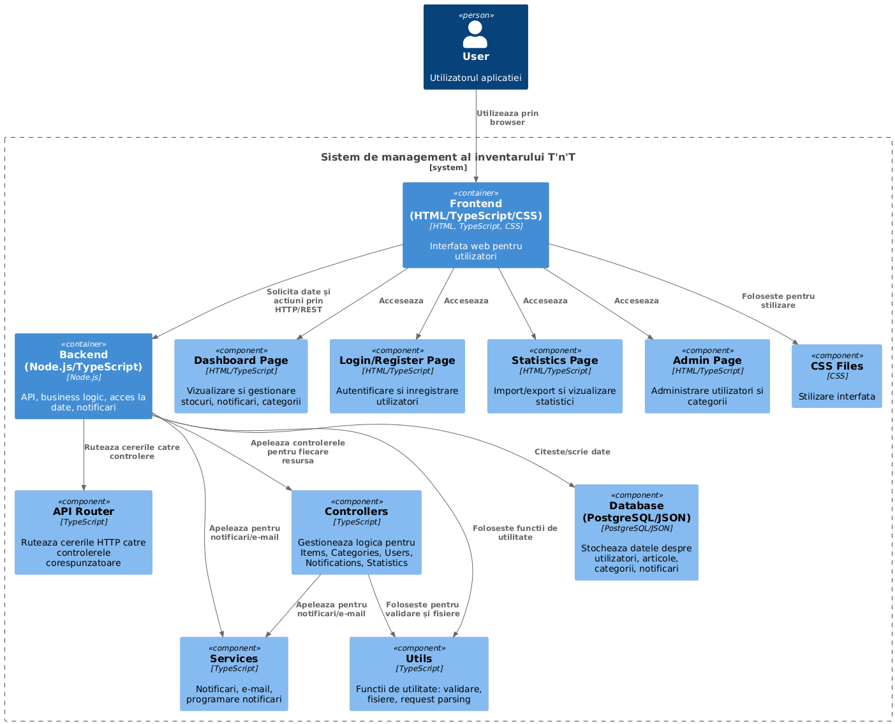

# T-n-T Inventory Management System

Web application for managing stocks of essential items, consumables, and spare parts used in a household, organization, or company.

The project follows the original implementation specification: centralizing items such as light bulbs, firewood, spices, toner, cosmetics, disposable cups, thumbtacks, common-use medicine, and spare parts for various devices, with emphasis on:

- category-based organization;
- quantity tracking;
- low-stock notifications;
- notifications shown inside the application and, optionally, by email;
- data import and export in CSV, JSON, and XML formats;
- statistics generation as HTML and PDF documents.

## Architecture



## Technology Stack

### Frontend

- HTML
- CSS
- JavaScript served statically by the backend

### Backend

- Node.js
- TypeScript
- HTTP server built on the native `http` module
- PostgreSQL

### Supporting Libraries

- `pg` for database access
- `bcrypt` for password hashing
- `nodemailer` for email delivery
- `papaparse` for CSV handling
- `xml-js` for XML handling
- `pdfkit` for PDF export

### Infrastructure

- Docker

## What the Project Currently Implements

- basic user registration and login;
- category management;
- item management with notification thresholds;
- automatic notification generation when `quantity <= notification_threshold`;
- email delivery for low-stock notifications if SMTP is configured;
- CSV, JSON, and XML export;
- CSV, JSON, and XML import;
- simple item statistics in HTML and PDF;
- static Web interface for login and dashboard pages.

## Important Notes

- The server starts a periodic job that checks stock levels every `STOCK_CHECK_INTERVAL_MS`.
- Emails are sent only if SMTP environment variables are configured. Otherwise, notifications remain in-app only.
- Exported statistics are table-based and use the items and categories currently stored in the database.
- Import works from the raw request body, not from multipart file upload.

## Project Structure

```text
T-n-T/
|-- frontend/
|   |-- index.html
|   |-- login.html
|   |-- dashboard.html
|   `-- public/
|       `-- css/
|
|-- backend/
|   |-- data/
|   |   |-- database.sql
|   |   `-- database.json
|   |-- public/
|   |   `-- js/
|   |-- src/
|   |   |-- config/
|   |   |-- controllers/
|   |   |-- routes/
|   |   |-- services/
|   |   |-- utils/
|   |   `-- server.ts
|   |-- Dockerfile
|   |-- package.json
|   `-- tsconfig.json
|
|-- docker-compose.yaml
|-- package.json
`-- README.md
```

## Data Model

The initial SQL schema defines the following tables:

- `users`
  - `id`
  - `username`
  - `password`
  - `email`
  - `created_at`
- `categories`
  - `id`
  - `name`
  - `description`
- `items`
  - `id`
  - `name`
  - `category_id`
  - `quantity`
  - `notification_threshold`
  - `created_at`
- `notifications`
  - `id`
  - `item_id`
  - `message`
  - `is_read`
  - `created_at`

## Configuration

The backend reads the following environment variables:

```env
PORT=3000
DB_HOST=localhost
DB_PORT=5432
DB_NAME=tnt_db
DB_USER=postgres
DB_PASSWORD=
SMTP_HOST=
SMTP_PORT=587
SMTP_USER=
SMTP_PASSWORD=
SMTP_FROM=no-reply@example.com
STOCK_CHECK_INTERVAL_MS=30000
```

## Running with Docker

Main command:

```bash
docker compose up --build
```

Defined services:

- `db` - PostgreSQL 16, initialized from `backend/data/database.sql`
- `backend` - Node.js server exposed on port `3000`

After startup:

- the application is available at `http://localhost:3000`
- the login page is served at `/` or `/login.html`
- the dashboard is served at `/dashboard` or `/dashboard.html`

## Running Locally

1. Install dependencies:

```bash
npm install
cd backend
npm install
```

2. Start PostgreSQL and create a database named `tnt_db`.

3. Run the SQL script from `backend/data/database.sql`.

4. Configure the backend environment variables.

5. Start the server:

```bash
cd backend
npm run dev
```

## How Notifications Work

When the server starts, it creates a periodic interval. On each run:

1. it finds items where `quantity <= notification_threshold`;
2. it avoids creating the same notification for the same item within 24 hours;
3. it inserts the notification into the `notifications` table;
4. it sends email to all users with an email address, if SMTP is configured.

## API Endpoints

Below is the list of endpoints actually implemented in the codebase.

### User Authentication

#### `POST /api/users/register`
Alias: `POST /users/register`

Request body:

```json
{
  "username": "demo",
  "email": "demo@example.com",
  "password": "password123"
}
```

Validation rules:

- `username` is required
- `email` is required
- `password` is required and must be at least 8 characters

Response `201`:

```json
{
  "id": 1,
  "username": "demo",
  "email": "demo@example.com"
}
```

#### `POST /api/users/login`
Alias: `POST /users/login`

Request body:

```json
{
  "email": "demo@example.com",
  "password": "password123"
}
```

Response `200`:

```json
{
  "message": "Autentificare cu succes",
  "userId": 1
}
```

### Categories

#### `GET /api/categories`

Returns all categories ordered alphabetically.

Response `200`:

```json
[
  {
    "id": 1,
    "name": "Electronics",
    "description": null
  }
]
```

#### `POST /api/categories`

Request body:

```json
{
  "name": "Consumables",
  "description": "Frequently used supplies"
}
```

#### `PUT /api/categories/:id`

Request body:

```json
{
  "name": "Office Consumables",
  "description": "Toner, paper, pens"
}
```

#### `DELETE /api/categories/:id`

Returns `204` on successful deletion.

### Items

#### `GET /api/items`

Returns all items ordered by creation date descending.

Response `200`:

```json
[
  {
    "id": 1,
    "name": "Printer toner",
    "category_id": 2,
    "quantity": 3,
    "notification_threshold": 5,
    "created_at": "2026-06-15T10:00:00.000Z"
  }
]
```

#### `POST /api/items`

Request body:

```json
{
  "name": "Printer toner",
  "category_id": 2,
  "quantity": 3,
  "notification_threshold": 5
}
```

Validation rules:

- `name` is required
- `quantity` must be a number `>= 0`
- `notification_threshold` must be a number `>= 0`
- `category_id` may be omitted or `null`

#### `PUT /api/items/:id`

Request body:

```json
{
  "name": "Color printer toner",
  "category_id": 2,
  "quantity": 2,
  "notification_threshold": 4
}
```

#### `DELETE /api/items/:id`

Returns `204` on successful deletion.

### Notifications

#### `GET /api/notifications`

Returns notifications together with the related item name.

Response `200`:

```json
[
  {
    "id": 1,
    "message": "Stoc redus pentru articolul: Toner imprimanta. Cantitate ramasa: 3.",
    "created_at": "2026-06-15T10:00:00.000Z",
    "is_read": false,
    "item_name": "Toner imprimanta"
  }
]
```

#### `PUT /api/notifications/:id/read`

Marks a notification as read.

#### `DELETE /api/notifications/:id`

Deletes a notification.

### Data Export

#### `GET /api/data/export/csv`

Downloads `items.csv`.

#### `GET /api/data/export/json`

Downloads `items.json`.

#### `GET /api/data/export/xml`

Downloads `items.xml`.

Exported data includes:

- `name`
- `category`
- `quantity`
- `notification_threshold`
- `created_at`

### Data Import

#### `POST /api/data/import/json`

Example request body:

```json
[
  {
    "name": "LED bulb",
    "category": "Electronics",
    "quantity": 10,
    "notification_threshold": 3
  }
]
```

#### `POST /api/data/import/csv`

Example request body:

```csv
name,category,quantity,notification_threshold
LED bulb,Electronics,10,3
Disposable cups,Consumables,50,10
```

#### `POST /api/data/import/xml`

Example request body:

```xml
<items>
  <item>
    <name>LED bulb</name>
    <category>Electronics</category>
    <quantity>10</quantity>
    <notification_threshold>3</notification_threshold>
  </item>
</items>
```

Import behavior:

- if the category does not exist, it is created automatically;
- if `notification_threshold` is missing, the default value `5` is used.

### Statistics

#### `GET /api/stats/html`

Generates an HTML document containing an item table.

#### `GET /api/stats/pdf`

Generates and downloads a PDF file named `statistici.pdf`.

#### `GET /api/statistics/html`

Additional route exposed from the data module with the same purpose: HTML report.

#### `GET /api/statistics/pdf`

Additional route exposed from the data module with the same purpose: PDF report.

## Frontend Resources Served by the Backend

- `GET /` -> `frontend/login.html`
- `GET /login.html` -> `frontend/login.html`
- `GET /dashboard` -> `frontend/dashboard.html`
- `GET /dashboard.html` -> `frontend/dashboard.html`
- `GET /public/*` -> static files from `frontend/public`

## Current Limitations

- There are no tokens, sessions, or JWTs; login only validates credentials and returns `userId`.
- There are no roles or permissions for user groups.
- There is no dedicated endpoint for fixed-date maintenance scheduling; the current implementation covers periodic low-stock checks.
- Import does not use `multipart/form-data`.
- The generated statistics documents are minimal and do not include charts.
- The project does not include an automated test suite.

